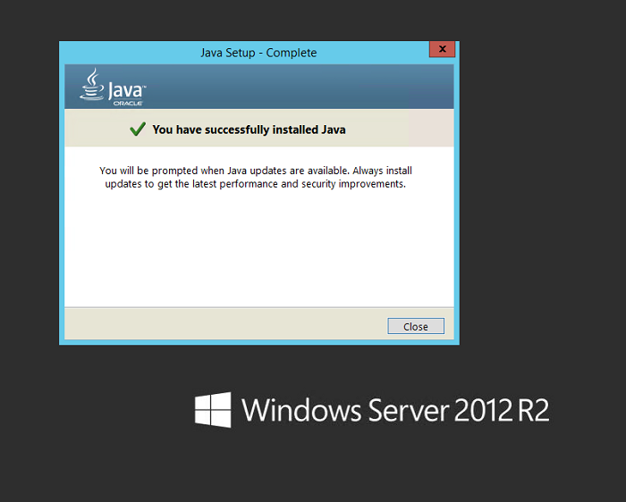
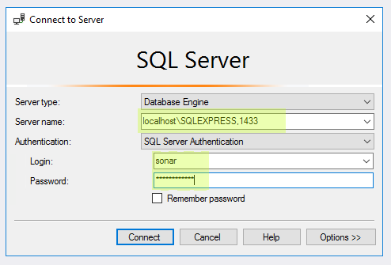

# Setting Up SonarQube Server.

	**>> NOTE >>** In this guide, we will demonstrate the installation and configurations using an Azure VM server 2016 r2 and sql 2016 express. 

### Deployment

- TFS Services and SQL Server are hosted on a single computer and SonarQube (all components) on a separate machine.
- Suitable for evaluation in production or near-production environments.

1. **Download**
	- Download **SonarQube 6.3.1** from the SonarQube [downloads](https://www.sonarqube.org/downloads/).

		
	- As mentioned in the Prerequisites section, a Java virtual machine (JVM) is required.
	- If the installed JVM meets the version requirements listed, you can skip this section. Otherwise, follow the steps below to install Java.
	- Download [Java SE Runtime Environment](http://www.oracle.com/technetwork/java/javase/downloads/jre8-downloads-2133155.html) and make sure you select the one corresponding to your current operation system.
	
> > 
		
**>> NOTE >>** SonarQube does not require the full Java JDK (Java SE Development Kit) to run- you only need the JRE (Java SE Runtime Environment).

2. **Install Java JRE**
	- Install **Java SE Runtime Environment** on the destination server.
	
> > 

3. **Configure sql server**

Before you get to the task of creating a new database for SonarQube, you need to complete a few preparations.

1. **Launch SSMS**
	- Launch **SQL Server Management Studio** (SSMS).
	- Connect to the SQL Server instance on which you plan to create the database.
 - Select left button on the server instance and select properties => Security.
 
> 
 
> 
  
> 
   
> 
 
 - Select the **SQL Server and Windows Authentication**
 
> -Create a user with SQL Server authentication, called sonar with a password.

> -Security > right click on Logins > New Login.

> > 

> > 

> Then you should open Sql Server Configuration Manager, and you must enable the TCP Procol.

> > 

> Open Properties for TCP/IP protocol. 

> Disable dynamic ports and specify 1433 as TCP Port.

> > 

Back to **SQL Server Management Studio** (SSMS).

> Create a new database called Sonar with sonar user as owner

> > 

> Now be sure to select the correct Collation, remember that you should use a collation that is Case Sensitive and Accent Sensitive, like 

> SQL_Latin1_General_CP1_CS_AS.

> Specify the right Collation for the database. It should be CS and AS.

> > 

> Now, just to be sure that everything is ok, try to connect from Management Studio using the port 1433 and with user sonar. 

> To specify port you should use a comma between server name and the port.

> > 

> Verify that you can see Sonar database. If you are able to connect and see Sonar Db you have everything ready. 

4. **Extract SonarQube**

- Right-click on sonarqube-x.x.zip, select Properties and then select the Unblock box. 

> > 

- Unzip SonarQube-x.x.zip on to a drive, for example use C:\SonarQube\

> > 

- At this point, the installation is complete.

5. **Configure SonarQube**

- Basic configuration of SonarQube consists of making a few updates to the sonar.properties file.

- This file is located in the conf folder located under the SonarQube installation folder. Example: C:\SonarQube\SonarQube-6.3.1\conf\sonar.properties

> > 

- In run prompt type services.msc and search for SonarQube service. Change the service logon user account to SonarUser. Start the service and refresh the services console after a few seconds to ensure that the service hasn’t failed. If the service has failed to start look in the log file to see the reason for the failure.

> > 

Run startsonar.bat in C:\SonarQube\sonarqube-6.3.1\bin\windows-x86-64, to test.

You can now browse SonarQube at http://localhost:9000 (the default System administrator credentials are admin/admin).
Stop by pressing ctrl+c.

Allow firewall inbound port 9000 to make http://my-sonarqube-16.westeurope.cloudapp.azure.com work. 

Now open ports on the Server Windows firewall so we can access the SonarQube server and SQL from outside the machine. Return to the command prompt and simply run the following commands to add the firewall rules.

netsh advfirewall firewall add rule name="SQL" dir=in action=allow protocol=TCP localport=1433

netsh advfirewall firewall add rule name="Sonar" dir=in action=allow protocol=TCP localport=9000

The final step is to open ports to a virtual machine with the Azure portal.

https://docs.microsoft.com/en-us/azure/virtual-machines/windows/nsg-quickstart-portal

Inbound securiry rules:

- Allow RDP IN,

- Allow HTTPS IN,

- Allow SonarQube In,

- Block All In.

----

How to create a SonarQube server on Azure with Template

https://github.com/Azure/azure-quickstart-templates/tree/master/sonarqube-azuresql

Ones done address is:  

#####http://[sq_PublicIP_DnsPrefix].[AzureRegion].cloudapp.azure.com:9000
Ex: http://my-sonarqube.westeurope.cloudapp.azure.com:9000 Ex: Secure https://my-sonarqube.westeurope.cloudapp.azure.com
